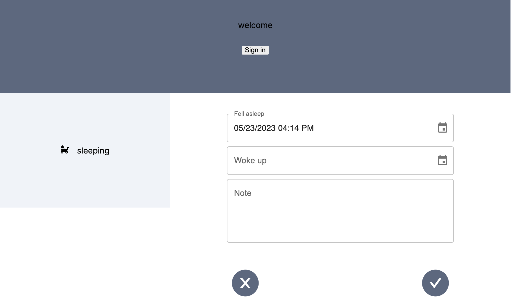
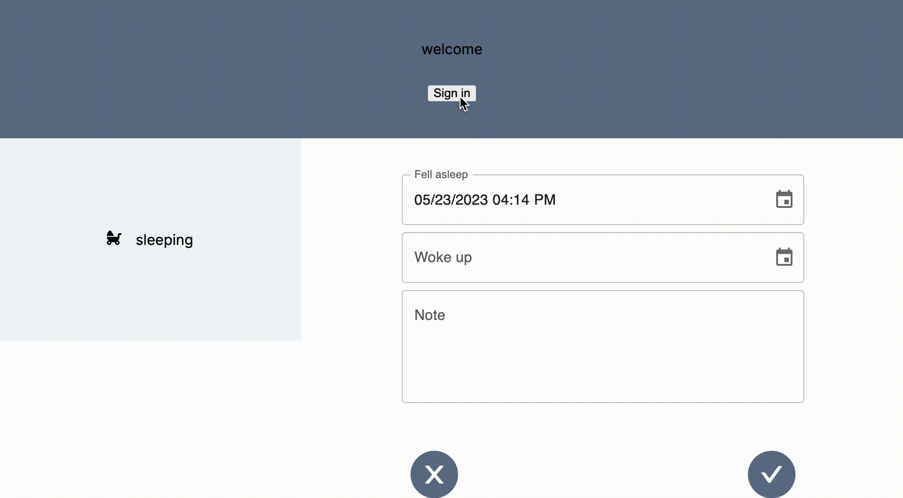
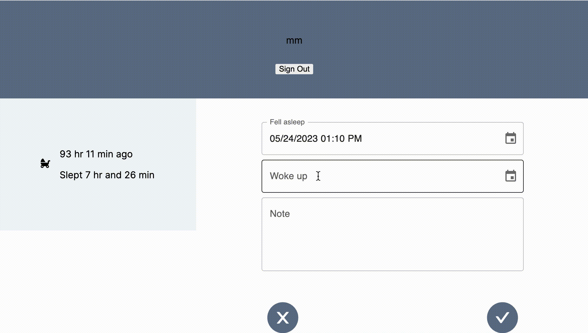

<!--  -->
<!--  -->

## About

## Check out this app at [Baby'sleep tracker](https://babysleep.vercel.app/)!

#### This is an app that can help parents record and analyze their baby's sleep.

## Features:

#### This app comes with full authentication.

## 

#### On the home page, users can record their baby's sleep time.

## 

#### Users can choose to view their baby's sleep patterns in the form of a list or a chart.

## 

#### Users can choose to view their baby's sleep data for the past 7 days, the past month, or any specific week or month..

## 

## Later Additions:

- Add more data to track, such as feeding, pumping and diaper changes
- Expand to a mobile app
- Allow user to download the data

## Built With:

